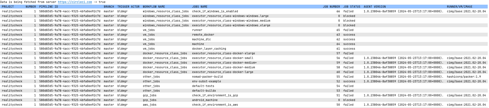
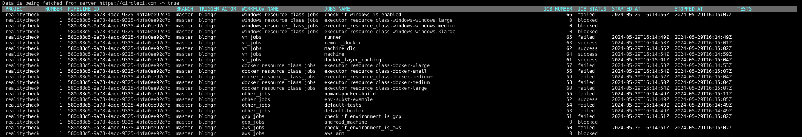

# circleci-servercli

Used to call the CircleCI API and display the dashboard

## Getting Started
Building from source, follow the source Development instructions.


## Development instructions
Cloning the project and build locally 
```
git clone https://github.com/bldmgr/circleci-servercli.git
cd circleci-servercli/
go build -o servercli ./cmd
chmod 700 servercli
sudo mv servercli /usr/local/bin/servercli
```


When configuring servercli behaviour you can use these methods, listed in order of highest to lowest precedence (first one wins):

- <u>Command-line flags</u> such as `--help`. These have precedence over properties and environment variables.
- <u>Local Configuration</u> such as `CIRCLE_HOSTNAME` can be stored in a `ci.yaml` file (see init command).
- <u>Environment variables</u> such as `CIRCLE_HOSTNAME` sourced by the environment that executes juno.

Before using the CLI, you need the following client configuration environment variables.

```
export CIRCLE_HOSTNAME=https://circleci.com
export CIRCLE_TOKEN=a2434343242382918381
export CIRCLE_NAMESPACE=namespace
```

### servercli -h
```
Servercli is a compact and smart client that provides a simple interface that automates access to CircleCI’s API.

Usage:
  servercli [command]

Available Commands:
  dashboard   Checking if connection is successful
  help        Help about any command
  init        Sets up local environment to work with circle
  tree        Single project view with more data

Flags:
  -h, --help          help for servercli
      --home string   location of your config. Overrides $CIRCLE_HOME (default "/Users/mimontpe")

Use "servercli [command] --help" for more information about a command.
```

## Available Commands

**init**: used to create a local configuration `$home\ci.yaml` file.

```
Sets up local environment to work with circle

Usage:
  servercli init [flags]

Flags:
  -h, --help   help for init

Global Flags:
      --home string   location of your config. Overrides $CIRCLE_HOME (default "/Users/mimontpe")
```

**dashboard**: The Dashboard.
```
Usage:
  servercli dashboard [flags]

Flags:
  -a, --actor string       Actor name (default "all")
  -e, --expand string      Expand data to show host
  -h, --help               help for dashboard
  -p, --project string     Project Name (default "all")
  -q, --query-aws string   Query AWS
  -s, --status string      Status of jobs (default "all")
  -t, --theme string       Dashboard Theme (dark, light) (default "default")

Global Flags:
      --home string   location of your config. Overrides $CIRCLE_HOME (default "/Users/mimontpe")
```

```
servercli dashboard
Data is being fetched from server https://circleci.com -> true
╭─────────┬────────┬──────────────────────────────────────┬────────┬───────────────┬─────────────────────┬───────────┬────────────┬────────────┬──────────────────────┬──────────────────────┬───────╮
│ PROJECT │ NUMBER │ PIPELINE ID                          │ BRANCH │ TRIGGER ACTOR │ WORKFLOW NAME       │ JOBS NAME │ JOB NUMBER │ JOB STATUS │ STARTED AT           │ STOPPED AT           │ TESTS │
├─────────┼────────┼──────────────────────────────────────┼────────┼───────────────┼─────────────────────┼───────────┼────────────┼────────────┼──────────────────────┼──────────────────────┼───────┤
│ bogus   │      1 │ d1c36db3-66cf-4a1f-9a44-54da247bac18 │ master │ bldmgr        │ circleci-logs-build │ build     │          1 │ failed     │ 2024-05-29T14:38:39Z │ 2024-05-29T14:38:39Z │       │
╰─────────┴────────┴──────────────────────────────────────┴────────┴───────────────┴─────────────────────┴───────────┴────────────┴────────────┴──────────────────────┴──────────────────────┴───────╯
```
#### Dashboard Theme 
**light**

**dark**


**tree**: Single project view with more data
```
Usage:
servercli tree [flags]

Flags:
-a, --action string   Show job steps (exp) (exp-all)
-d, --data string     Show job output
-h, --help            help for tree
-i, --id string       Pipeline Id
-j, --job string      Show only job number steps
-s, --status string   Status of job (default "all")

Global Flags:
--home string   location of your config. Overrides $CIRCLE_HOME (default "/Users/username")
```

Show pipeline workflow and jobs 
```
servercli tree -i a834e509-6a87-4757-8ebf-dd275283d3f8
----------------------------------------------------------------------------------------------------
── project-rails
   ├─ linter_jobs
   │  ├─ 204690 schema_version_check (success)
   │  ├─ 204691 rubocop (success)
   │  ├─ 204687 data_migration_check (success)
   │  ├─ 204688 common_layouts_teaspoon (success)
   │  ├─ 204686 common_layouts_rspec (success)
   │  ╰─ 204689 brakeman (success)
   ├─ js_tests
   │  ╰─ 204685 js (success)
   ├─ unit_tests
   │  ├─ 204684 unit_tests (success)
   │  ╰─ 204695 save_runtimes (success)
   ╰─ capybara_tests
      ├─ 204683 capybara (success)
      ╰─ 204696 save_runtimes (success)
```

Show pipeline configuration by step number with output
```
servercli tree -i a834e509-6a87-4757-8ebf-dd275283d3f8 -a exp -j 204685 -d 102
----------------------------------------------------------------------------------------------------
── project-rails
   ├─ linter_jobs
   │  ├─ 204690 schema_version_check (success)
   │     ├─ 0 Spin up environment
   │     │  ╰─ 
   │     ├─ 99 Preparing environment variables
   │     │  ╰─
   │     ├─ 101 checkout
   │     │  ╰─
   │     ├─ 102 run
   │     │  ╰─ cp .env.template .env
   │     │     docker volume create --name=portal_bootsnap_cache
   │     │     docker volume create --name=portal_vendor_bundle
   │     │     docker compose -f docker-compose.yml -f docker-compose.ci.yml pull
   │     │
   │     │     ╰─ portal_bootsnap_cache
   │     │        portal_vendor_bundle
   │     │        WARN[0000] The "PARALLEL_TEST_ENV_NUMBERS" variable is not set. Defaulting to a blank string.
   │     │        WARN[0000] The "PARALLEL_TEST_GROUPS" variable is not set. Defaulting to a blank string.
   │     │        WARN[0000] The "PARALLEL_TEST_GROUPS" variable is not set. Defaulting to a blank string.
   │     │        WARN[0000] The "PARALLEL_TEST_ENV_NUMBERS" variable is not set. Defaulting to a blank string.
   │     │        WARN[0000] The "outfile" variable is not set. Defaulting to a blank string.
   │     │        WARN[0000] The "PARALLEL_TEST_ENV_NUMBERS" variable is not set. Defaulting to a blank string.
   │     │        WARN[0000] The "PARALLEL_TEST_GROUPS" variable is not set. Defaulting to a blank string.
   │     │        WARN[0000] The "PARALLEL_TEST_ENV_NUMBERS" variable is not set. Defaulting to a blank string.
   │     │        WARN[0000] The "PARALLEL_TEST_GROUPS" variable is not set. Defaulting to a blank string.
   │     │        [+] Pulling 17/0
   │     │         ✔ bundle_audit Skipped - Image is already being pulled by brakeman                0.0s
   │     │         ✔ capybara Skipped - Image is already being pulled by brakeman                    0.0s
   │     │         ✔ capybara_coverage_audit Skipped - Image is already being pulled by brakeman     0.0s
```